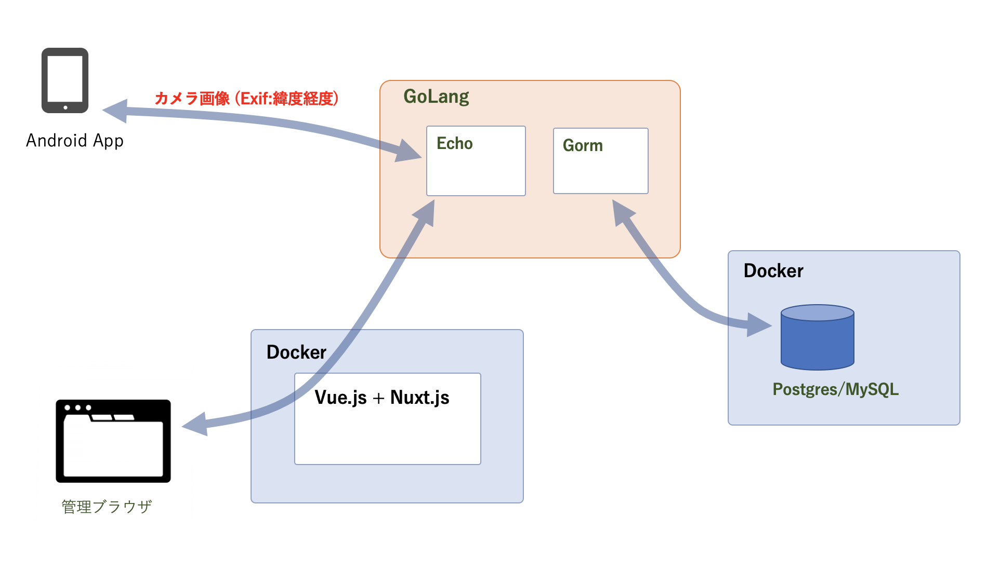
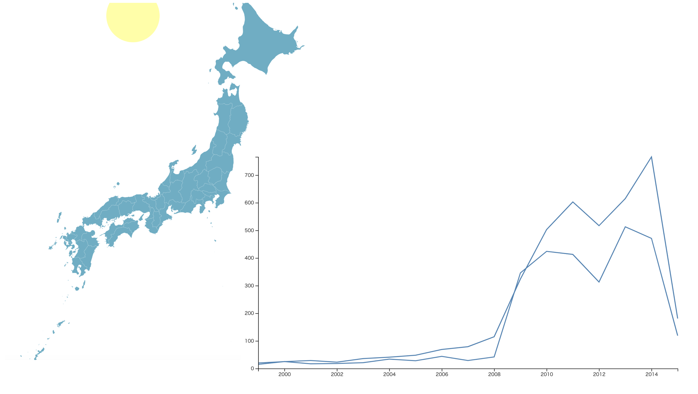

## iot-camera-spa-vue

> IoT Camera Nuxt.js project

## 構成



### Vue.js + D3.js

#### グラフ描画、GeoJSON/TopoJSONによる地図描画




### Build Setup

``` bash
# install dependencies
$ yarn install

# serve with hot reload at localhost:3000
$ yarn run dev

# build for production and launch server
$ yarn run build
$ yarn start

# generate static project
$ yarn run generate
```

For detailed explanation on how things work, checkout [Nuxt.js docs](https://nuxtjs.org).
